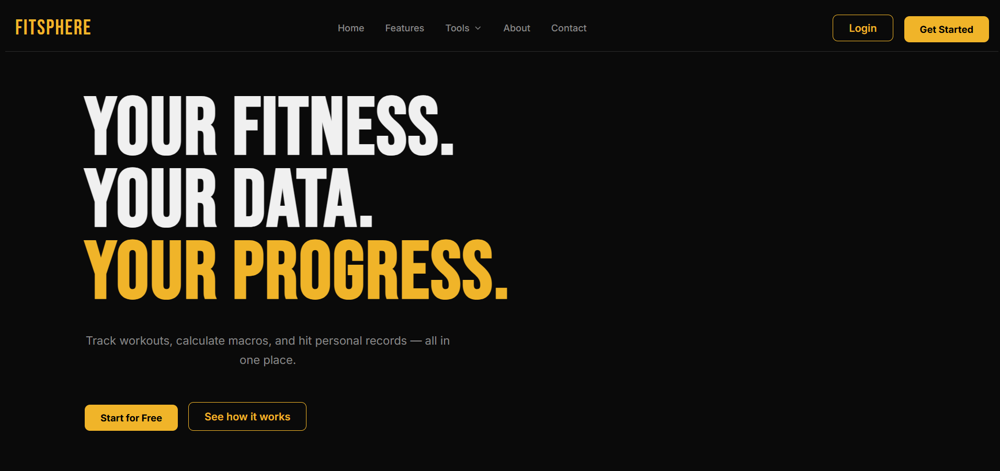
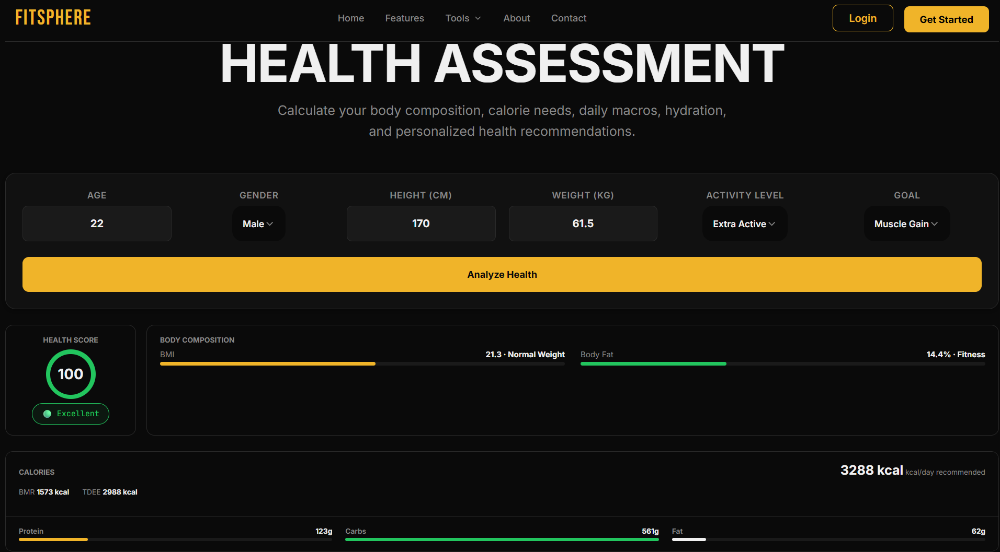
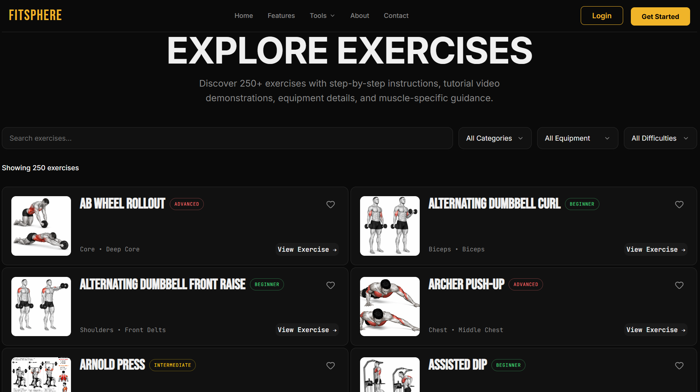
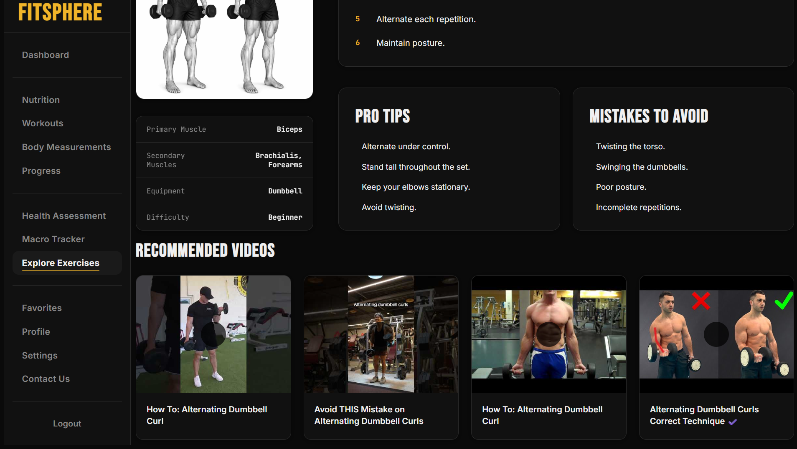
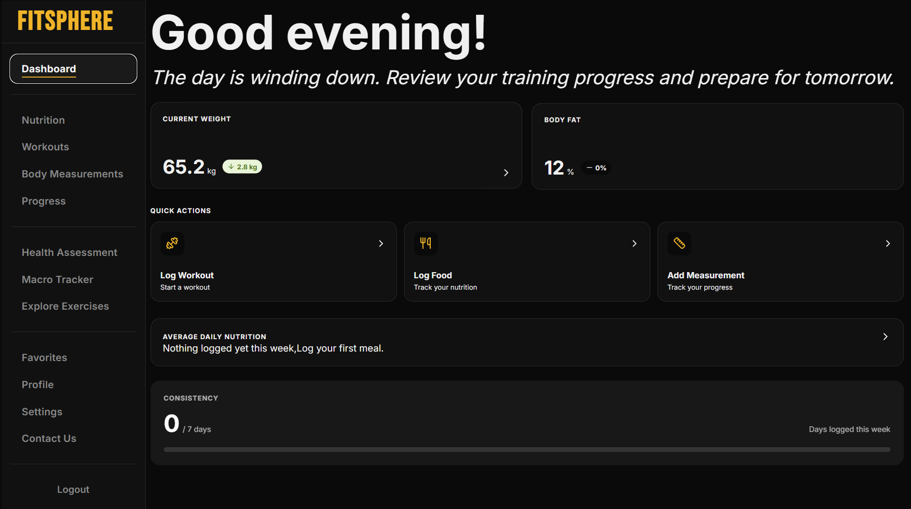
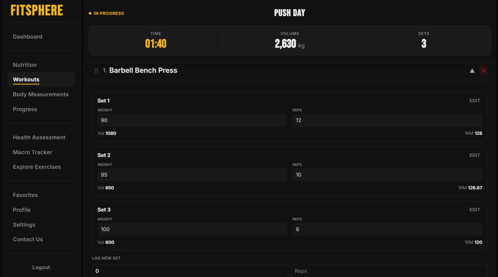
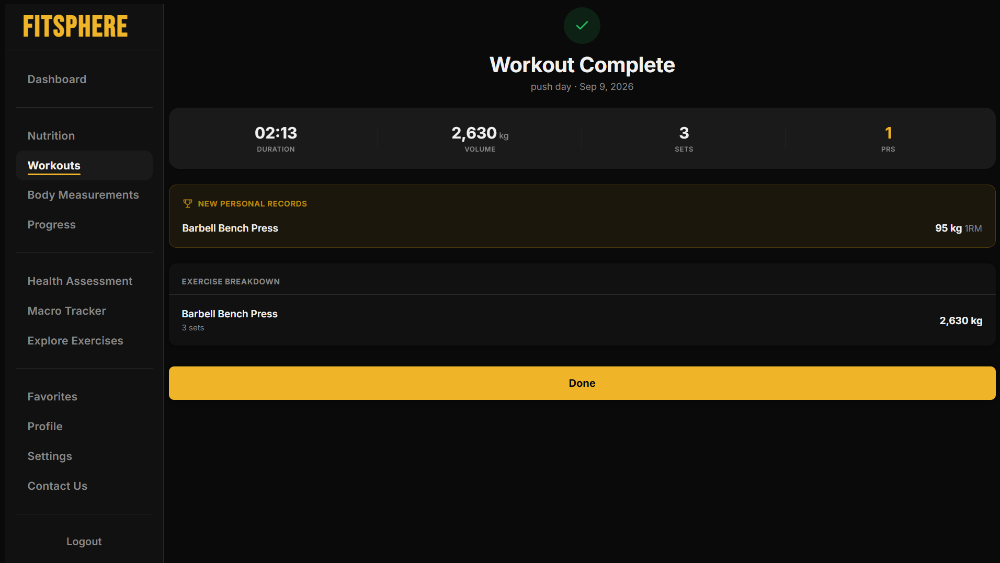
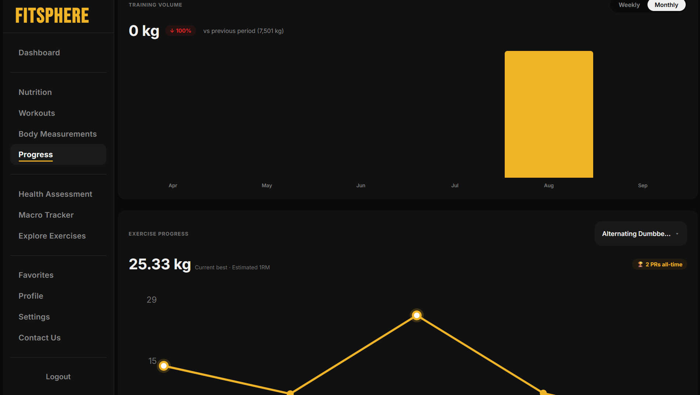
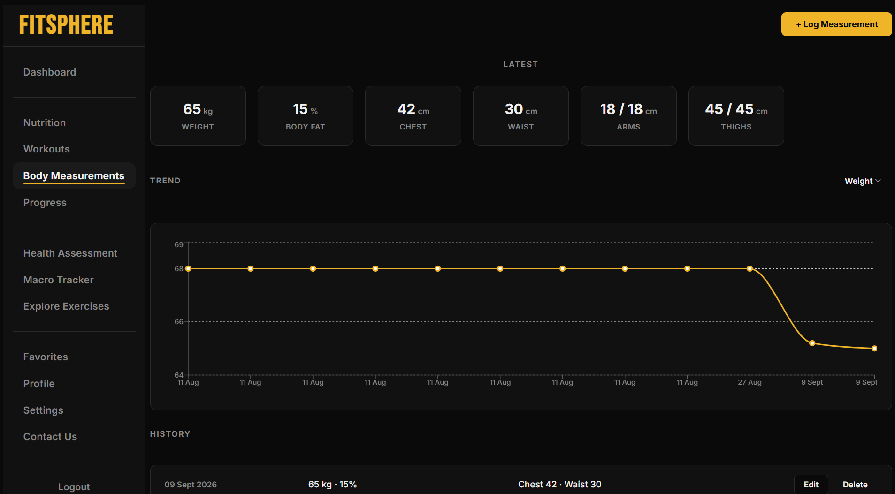
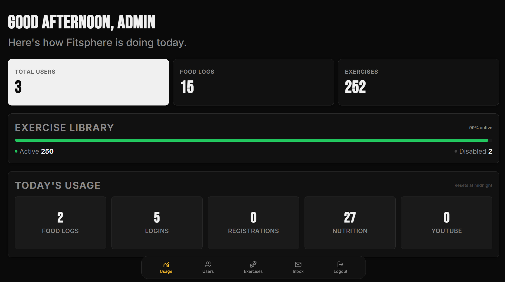

# FitSphere

**An all-in-one fitness platform** for tracking workouts, logging nutrition, monitoring body progress, and getting personalized health guidance — designed and built solo from frontend to backend to deployment.

🔗 **Live app:** [https://fitspherebysangamesh.vercel.app/](https://fitspherebysangamesh.vercel.app/)  
🔗 **API:** [https://fitsphere-s07g.onrender.com](https://fitsphere-s07g.onrender.com)  
🔗 **API docs:** [Swagger / OpenAPI](https://fitsphere-s07g.onrender.com/swagger-ui.html)


---

## What is FitSphere?

FitSphere is built around two user experiences:

###  Public

No account required.

- Health Assessment
- Macro Tracker
- Exercise Library
- Food search and details
- Exercise details and YouTube tutorials
- Public Contact Us form

The public features use real backend services and external APIs rather than mocked demo data. 

###  Authenticated

After registration, users get a personalized fitness tracking experience:

- Workout tracking
- Nutrition logging
- Body measurements
- Progress analytics
- Exercise and food favorites
- Personalized calorie and macro targets
- Profile and account settings

A separate `ROLE_ADMIN` area provides administration and support tools.

---

## Screenshots

### Public Experience

| Home                                    | Health Assessment |
|-----------------------------------------|---|
|  |  |

| Macro Tracker | Exercise Library |
|---|---|
|  |  |

### Exercise Details



### User Dashboard



### Workout Tracking

| Active Workout | Workout Complete |
|---|---|
|  |  |

### Progress & Measurements

| Progress Analytics | Body Measurements |
|---|---|
|  |  |

### Admin Dashboard



## Features

###  Workout Tracking

- Start workouts and log exercises, sets, reps and weight
- Each set is persisted immediately
- Automatic estimated **1RM using the Epley formula**
- Automatic **personal-record detection**
- PRs are re-evaluated after editing or deleting sets
- Reorder exercises and edit completed workouts
- Weekly/monthly training-volume analytics
- Per-exercise strength progression charts

###  Nutrition

- Live food search using **USDA FoodData Central**
- 350,000+ real food items
- Breakfast, lunch, dinner and snack logging
- Daily calorie and macro tracking
- Nutrition targets based on the user's health profile
- Public Macro Tracker with serving-size adjustment
- Food detail pages
- Favorite foods for quicker logging

###  Health Assessment

Calculates:

- BMI
- BMR
- TDEE
- Body-fat range
- Recommended calories
- Protein, carbohydrate and fat targets
- Personalized recommendations

The resulting nutrition targets are carried into the authenticated nutrition experience.

###  Exercise Library

- 250+ exercises
- Muscle groups, equipment and difficulty
- Step-by-step instructions
- Pro tips
- Common mistakes
- Search and filtering
- Live YouTube tutorial recommendations
- Category → muscle mapping for dependent filtering
- Favorite exercises

YouTube content is retrieved through the **YouTube Data API**.

###  Body Measurements

Track measurement history and visualize trends such as:

- Weight
- Body-fat percentage
- Arm / bicep measurements
- Waist
- Thigh
- Other supported body metrics

###  Authentication & Security

- JWT access + refresh tokens
- BCrypt password hashing
- Email verification with OTP
- OTP-based password reset
- Redis-backed rate limiting
- Role-based authorization
- Query-level ownership enforcement
- Cross-user access tests

Sensitive endpoints such as login, registration, nutrition search and YouTube search are protected with Redis-backed rate limiting. 
### ️ Admin Panel

Role-gated administration for:

- User management
- Enable / disable user accounts
- Exercise management
- Enable / disable exercises
- Usage analytics
- Contact/support inbox
- Admin email replies

The usage dashboard includes application metrics such as users, food logs, exercises and daily request volume.

---

## Architecture

```text
React + Vite
      │
      ▼
Spring Boot REST API
      │
      ├── Spring Security + JWT
      ├── Services
      ├── Repositories / JPA
      ├── DTOs / Mappers
      ├── Redis Rate Limiting
      └── External API Integrations
              │
       ┌──────┴──────┐
       ▼             ▼
 PostgreSQL        Redis
       │
       ├── USDA FoodData Central
       └── YouTube Data API
```

### Key design decisions

- **Sets are the unit of truth:** workout sets are persisted independently rather than waiting for workout completion.
- **Single source of truth for health calculations:** calculated nutrition targets flow into the user's stored profile.
- **Continuous analytics:** empty periods still produce zero-value buckets so charts remain aligned.
- **Environment-based configuration:** secrets and environment-specific values are externalized rather than hardcoded. 

---

## Tech Stack

### Backend


### Frontend


### External APIs


### Deployment & Infrastructure


---

##  Testing

FitSphere has **65 backend test classes** covering repository, service, controller and security layers.

The suite covers areas including:

- Workout and PR logic
- Health and macro calculations
- Analytics
- Repository queries
- JWT authentication
- Rate limiting
- Controller/API behavior
- Role-based access
- Cross-user ownership
- Email verification and password reset

```bash
./mvnw test
```

**Latest full test run:**

```text
Tests run: 603
Failures: 0
Errors: 0
Skipped: 0
BUILD SUCCESS
```

---

##  Deployment

```text
Frontend
   │
   ▼
Vercel
   │
   ▼
Render
Spring Boot API
   ├── Supabase PostgreSQL
   ├── Upstash Redis
   ├── USDA FoodData Central
   └── YouTube Data API
```

The same application code runs locally and in production through environment-based configuration.

---

## 🔮 What's Next?

- Frontend testing with Vitest + React Testing Library
- Workout routine templates
- Broader consistency tracking across workouts, nutrition and measurements

---

## 👨‍💻 Built By

[**Sangamesh Janadi**](https://github.com/sangamesh2k4)

Built solo — from product design and React UI to backend architecture, database design, authentication, testing, API integrations, Docker and deployment.